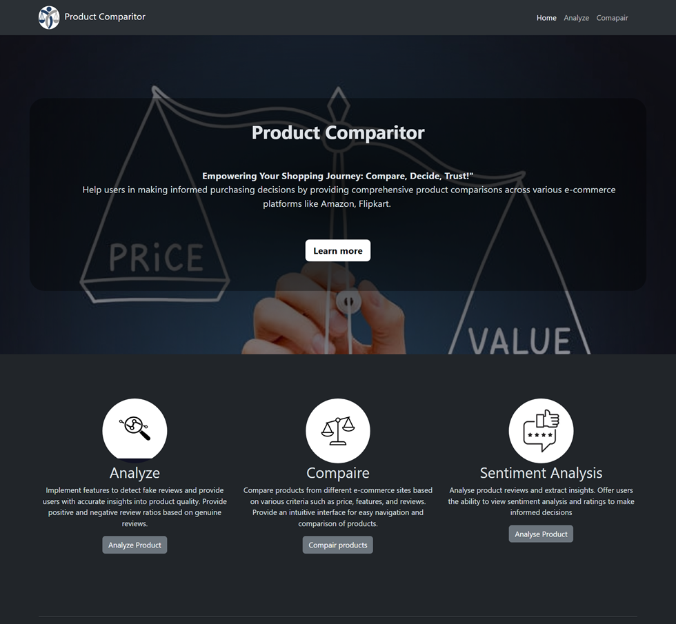
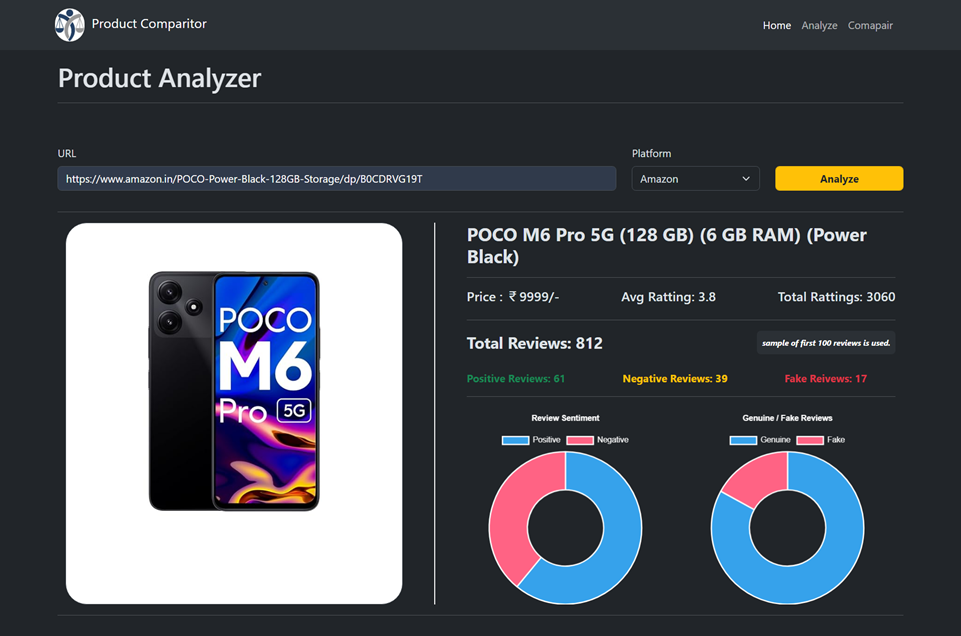
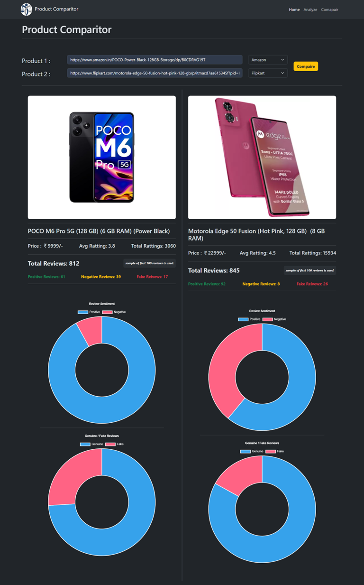
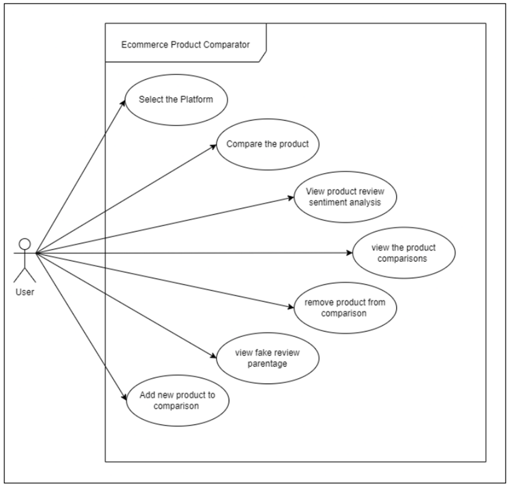
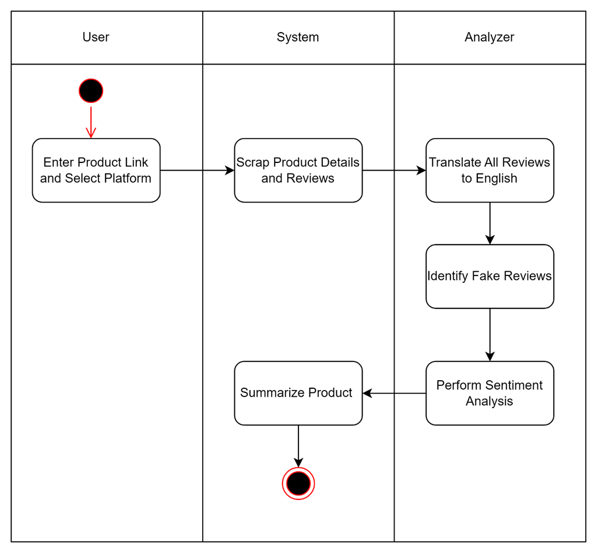
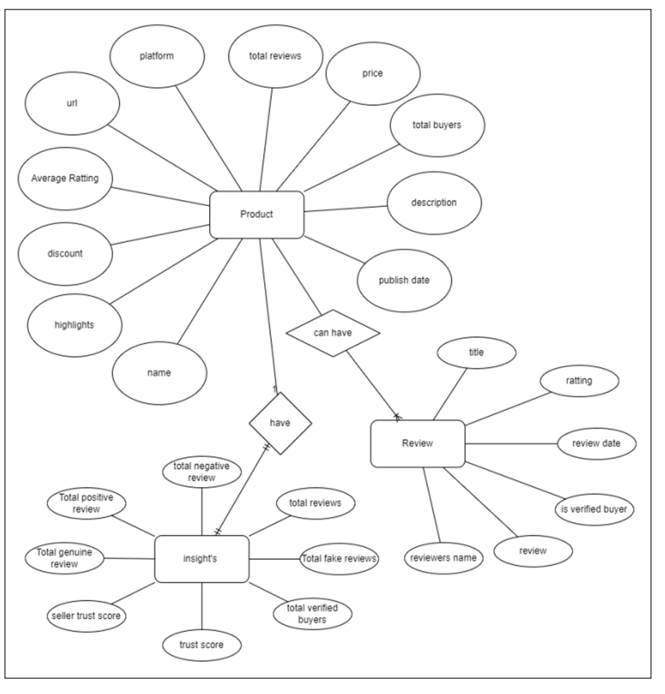
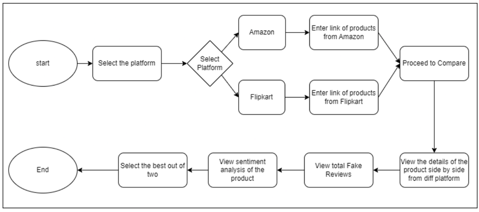

# 🛍️ E-Commerce Product Comparator

### 📌 Project Overview
E-Shop Express is an intelligent e-commerce product comparator that helps users make informed purchase decisions by offering side-by-side comparisons of products across top online marketplaces such as Amazon and Flipkart. The system ensures authentic reviews, detects fake feedback, and provides real-time sentiment analysis using machine learning.

### 🎯 Objectives
- **Assist Purchases:** Empower users to make smart buying decisions by comparing products across multiple platforms.

- **Review Transparency:** Identify and mitigate fake reviews to ensure authentic feedback using sentiment analysis.

- **Seamless Experience:** Provide a user-friendly interface with intuitive navigation and quick access to product details and reviews.

- **Fraud Protection:** Use algorithms to detect scam listings and protect users from fake products and sellers.

###🔍 Features
- 📦 Product Search and Comparison (Amazon & Flipkart)

- 🔍 Real-Time Web Scraping with Selenium

- 🧠 Sentiment Analysis with SGDClassifier (Scikit-learn)

- 🌍 Multilingual Support using Azure Translator API

- ⚡ Backend powered by FastAPI

- 🌐 Responsive Frontend with Angular & Bootstrap

- 📊 Review Visualization using Chart.js

- 📷 Screenshots
🔹 Home Page

User-friendly interface for product search and navigation

🔹 Analyze Page

Visual review analysis with sentiment detection

🔹 Comparison Page

Product comparison across multiple platforms

### 🛠️ Technologies Used
| Technology           | Purpose                                           |
|----------------------|---------------------------------------------------|
| Python               | Backend, Web Scraping, Sentiment Analysis         |
| Selenium             | Scraping live product and review data             |
| Scikit-learn         | Review Classification and Sentiment Detection     |
| FastAPI              | Backend API development                           |
| Angular              | Frontend UI framework                             |
| Bootstrap            | UI Styling and Responsiveness                     |
| Chart.js             | Graphical representation of review sentiments     |
| Azure Translator API | Translating regional reviews to English           |

### 🔄 System Architecture & Diagrams
**Use Case Diagram**

**Activity Diagram**

**Entity Relationship (ER) Diagram**

**Flowchart**

### ⚠️ Limitations
- ⏳ **Loading Time:** Fetching and analyzing data may result in delays.

- 🧊 **Cold Start Problem:** Limited data for new products reduces accuracy.

- 📈 **Scalability:** Performance may degrade with increasing users or product data volume.

- 🌐 **Language Barrier:** Regional reviews may be mistranslated due to detection issues.

## ✅ Conclusion
This mini project has effectively demonstrated how modern tools like Python, Selenium, FastAPI, Scikit-learn, and Azure Translator API can be integrated to build a smart, reliable product comparison engine. It ensures a balance of functionality, performance, and user trust, and sets the groundwork for future advancements in e-commerce analytics.
